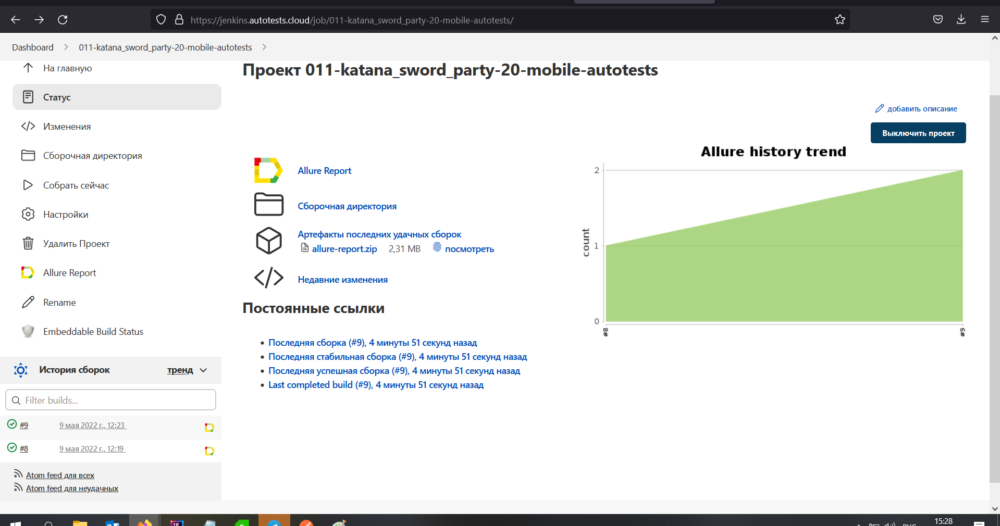
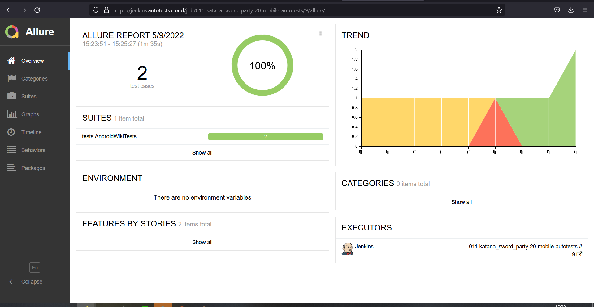
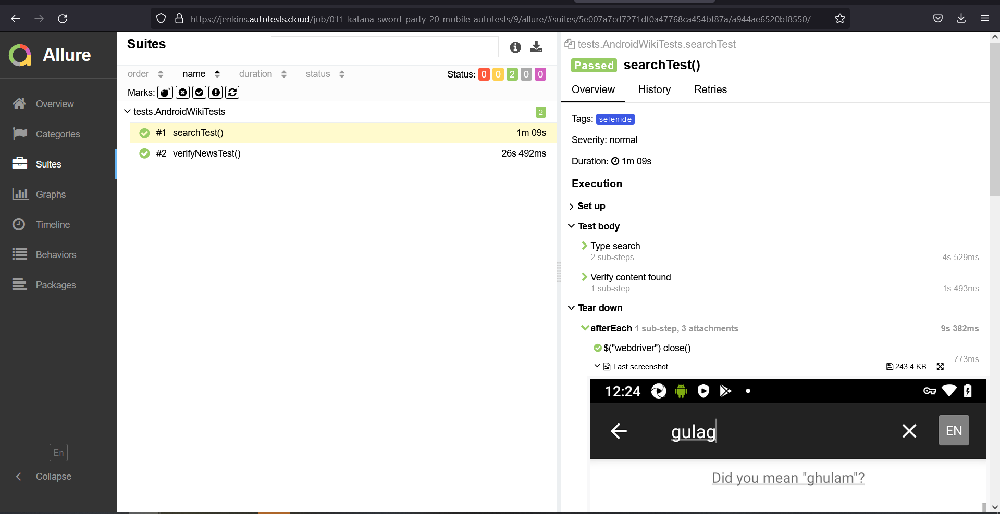
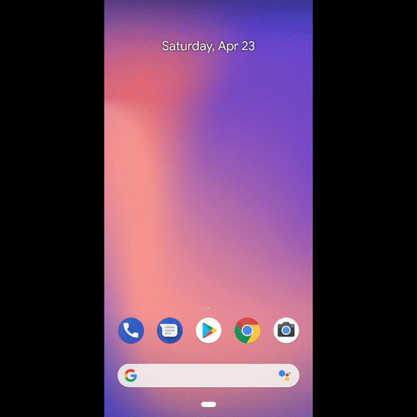

# Проект по автоматизации мобильного UI тестирования приложения Wikipedia

## :japanese_ogre: Технологии и инструменты

## :japanese_ogre: Реализованные проверки
- Поиск статей в приложении
- Наличие блока новостей на главной странице
- 
## :japanese_ogre: Сборка в Jenkins
### <a target="_blank" href="https://jenkins.autotests.cloud/job/011-katana_sword_party-13-autotests/">Сборка в Jenkins</a>

## :japanese_ogre: Allure отчет
- ### Главный экран отчета

- ### Страница с проведенными тестами

## :shinto_shrine: Видео примеры прохождения тестов
> К каждому тесту в отчете прилагается видео. Одно из таких видео представлено ниже.

  

